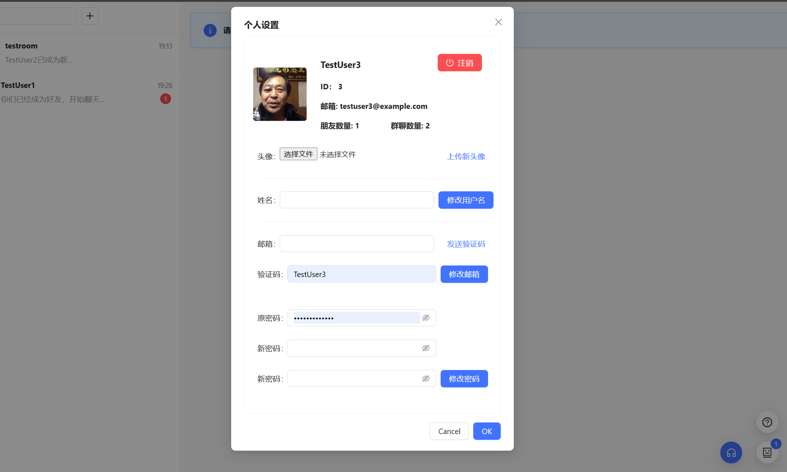
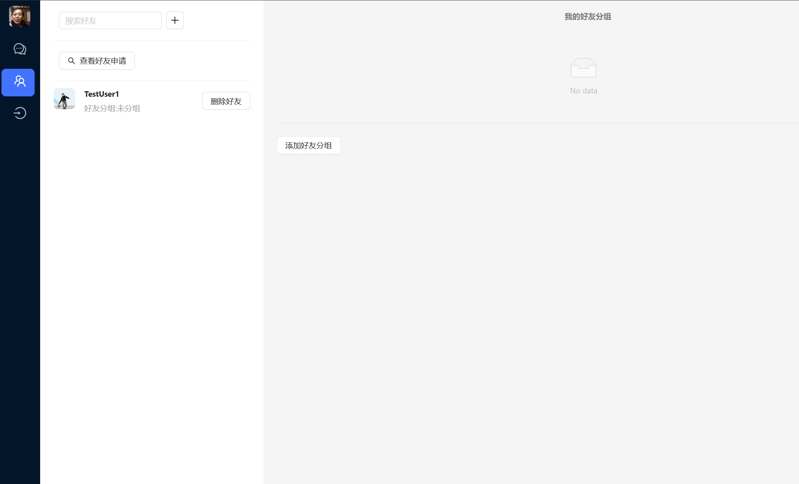
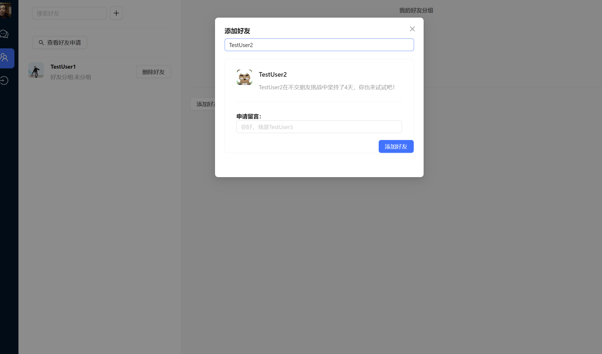
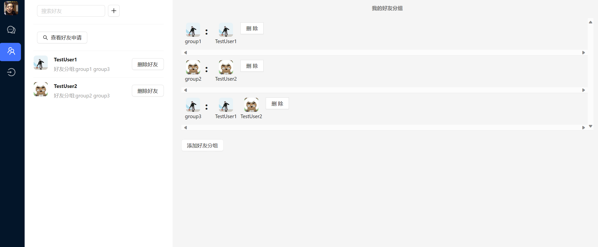

# 用户手册

## 登录与注册

登录与注册界面如下

RISCV-V使用邮箱验证码注册，支持密码登录与邮箱验证登录两种方式。

1. 邮箱注册：登录注册界面-Registry-进行注册
2. 密码登录：登录注册界面-Username-输入用户名与密码
3. 邮箱登录：登录注册界面-Email-输入邮箱及验证码

## 用户信息管理

用户信息管理界面如下：

在左侧显示了用户的基本信息，下方是用户信息修改界面，包括上传头像、修改用户名、修改邮箱绑定、修改密码等功能。在页面的上方可以注销用户。

## 好友管理

好友管理页面如下：

左侧显示了好友列表，右侧显示了好友分组。

通过左上角的’+’可以搜索用户名字来发送添加好友申请

在“查看好友申请”一项中可以查看好友的申请并同意或拒绝。

添加好友后，好友出现在左侧好友列表中，同时可以在好友列表中删除好友。

在页面的右侧可以添加好友分组，添加好友分组需要输入分组名称、添加的好友，添加分组后，会在右侧显示已经添加的分组：

## 群聊

群聊的页面如下，左侧是该用户所在群聊的列表，右侧是某一群聊的聊天窗口：

### 创建群聊

群聊界面-左上角‘+’-选择添加的群聊用户-创建群聊

### 群聊信息

点击群聊界面右侧的消息栏，可以查看群聊的信息，包括群成员、群公告、备注、昵称等，同时可以进行对于群聊的操作

### 群聊管理

转让群主：群聊信息-群管理-转让群主

设置管理员：群聊信息-群管理-设置管理员

移除群成员：群聊信息-群管理-移除群成员

### 成员管理

成员邀请：群聊信息-成员列表中添加

退出群聊：群聊信息-退出群聊

## 在线会话

在群聊界面的输入框中输入文字即可发送消息，在一条消息附近可以查看未读用户。

在线会话支持对图片、语音、文件、表情的发送，在聊天框上侧可以选择发送的类型。

点击聊天框上侧最右侧的图标可以查看聊天记录并进行筛选。

右键单击一条消息可以进行翻译、引用、删除、转发等操作。

在群聊信息一栏中可以进行消息免打扰、置顶聊天的设置。